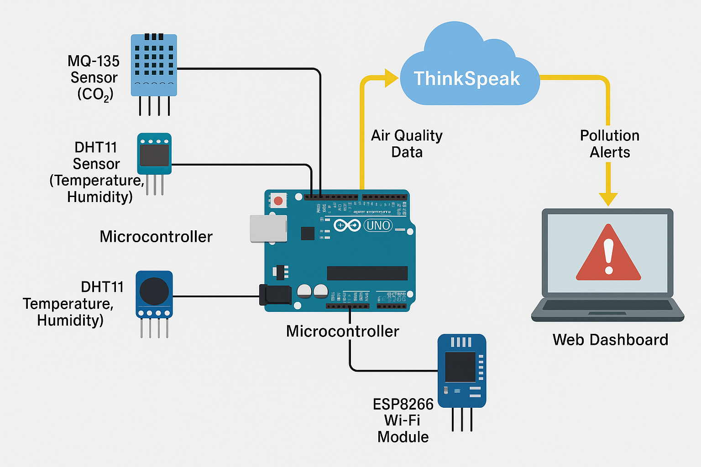

# IoT-Based Air Pollution Monitoring System

This repository contains a real-time air quality monitoring system built using IoT technologies. It measures the concentration of harmful gases like CO₂ and CO using an MQ-135 sensor, processes the data using an ESP8266 microcontroller, and uploads the values to ThingSpeak for live visualization.

Developed as a B.Tech final year project, this solution provides an affordable and scalable way to measure air pollution across indoor and outdoor environments.

---

##  Overview

- **Category**: IoT, Environmental Monitoring
- **Hardware**: ESP8266 (NodeMCU), MQ-135 Gas Sensor
- **Software**: Arduino IDE, ThingSpeak Cloud
- **Connectivity**: Wi-Fi
- **Data**: Gas Concentration Levels (Analog Values)

---

##  Features

- Real-time air pollution monitoring
- Live dashboard via ThingSpeak
- Wi-Fi-based data transmission
- Low-cost and easy to deploy
- Can trigger alerts if pollution exceeds thresholds

---

##  Hardware Components

| Component            | Quantity | Description                                       |
|---------------------|----------|---------------------------------------------------|
| ESP8266 NodeMCU     | 1        | Wi-Fi microcontroller                             |
| MQ-135 Sensor       | 1        | Detects harmful gases (CO, CO₂, NH₃, NOₓ, etc.)   |
| Jumper Wires        | —        | For connections                                   |
| Breadboard          | 1        | Circuit prototyping                               |
| 5V USB Power Supply | 1        | Powering the NodeMCU                              |

---

## 🛠 Software & Libraries

- [Arduino IDE](https://www.arduino.cc/en/software)
- ESP8266WiFi Library
- ThingSpeak Library
- Serial Monitor (for debugging and calibration)

---

## ⚙ How It Works

1. **Sensor Reading**: MQ-135 outputs analog values representing air quality.
2. **Wi-Fi Connection**: ESP8266 connects to a local Wi-Fi network.
3. **Data Upload**: The analog reading is sent to ThingSpeak every 20 seconds.
4. **Visualization**: ThingSpeak plots the data in real-time.
5. **Threshold Alerts**: Optionally, thresholds can be configured to trigger alerts.

---

##  Circuit Diagram



- MQ-135 VCC → 5V
- MQ-135 GND → GND
- MQ-135 AOUT → A0 (NodeMCU)
- NodeMCU powered via USB or battery

---

##  Sample Code (air_pollution.ino)

```cpp
#include <ESP8266WiFi.h>
#include <ThingSpeak.h>

const char* ssid = "your_SSID";
const char* password = "your_PASSWORD";
const char* writeAPIKey = "YOUR_API_KEY";
unsigned long channelNumber = 123456;

WiFiClient client;
int gasSensorPin = A0;

void setup() {
  Serial.begin(115200);
  WiFi.begin(ssid, password);
  while (WiFi.status() != WL_CONNECTED) {
    delay(1000);
    Serial.println("Connecting...");
  }
  ThingSpeak.begin(client);
}

void loop() {
  int airQuality = analogRead(gasSensorPin);
  Serial.println(airQuality);
  ThingSpeak.writeField(channelNumber, 1, airQuality, writeAPIKey);
  delay(20000);
}
Dashboard
Create a ThingSpeak account at https://thingspeak.com

Set up a new channel and get:

Channel ID

Write API Key

Replace in code before uploading

 How to Set Up
Open the .ino file in Arduino IDE

Add ESP8266 Board Manager URL:
http://arduino.esp8266.com/stable/package_esp8266com_index.json

Install required libraries from Library Manager

Replace Wi-Fi and ThingSpeak credentials

Upload the code and open Serial Monitor

View data live on ThingSpeak

 Use Cases
Indoor air quality monitoring (homes, schools)

Environmental labs or academic research

Smart city sensor nodes

Industrial emission checks

 Future Scope
Add support for multiple gases using additional sensors (e.g., MQ-7, MQ-9)

GPS module for geotagged pollution maps

SMS/email alerts using IFTTT or Twilio

Mobile dashboard app (Flutter/React Native)

 Author
Bijoy Laxmi Biswas
IoT Developer | Engineer | Tech Explorer
